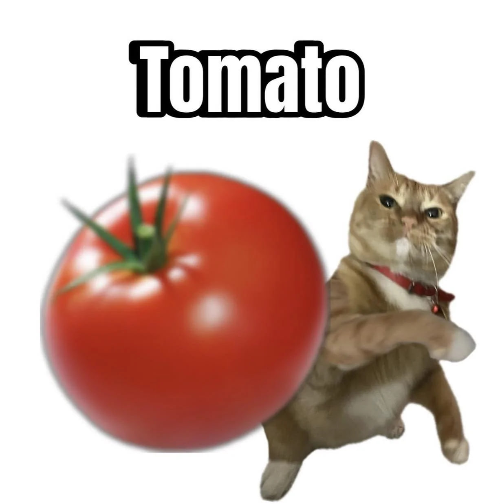
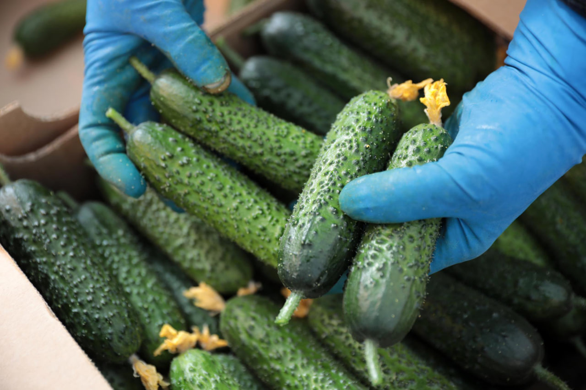

# 🍅🥒 Tomato vs Cucumber Classifier (OpenCV, No Machine Learning!)

**[GreenOrRed?](GreenOrRed.ipynb)** - A simple color-based classification project for tomatoes and cucumbers using OpenCV.  

## 🖼️ Sample Images

  
*Example of a tomato*

*Cucumber example*

## 📊 Data: `labels.csv`

File format:

| filename | label     | conditions |
|---------|-----------|------------|
| img_001.jpg | tomato | 1 |
| img_002.jpg | cucumber | 3 |

### What does `conditions` mean?

These are **shooting conditions** that help analyze the effects of lighting, background, and image quality:

- **1** — The ideal is a clean vegetable on a neutral background, smooth light, no interfering elements.
- **2** — The usual conditions are vegetables on the background, dirt, non—standard shape/color, several objects in the frame, faint shadows or reflections.
- **3** — Extremely uneven background, noise, glare, damaged or partially visible vegetables.

 This allows you to check how resistant the algorithm is to various conditions.
